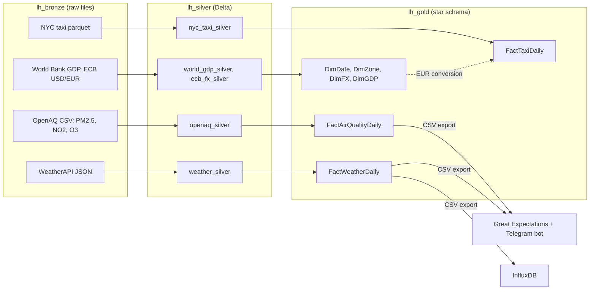

# data_warehouse

A course project: a medallion-style (bronze → silver → gold) data warehouse on
**Microsoft Fabric** that joins 2024 New York taxi trips, weather, air quality and
USD/EUR rates into a star schema, plus a small data-quality loop (Great Expectations +
Telegram bot) and an InfluxDB export.



## Layout

| Folder | What it does |
| --- | --- |
| `bronze_to_silver/` | `ingest_weather.py` pulls daily NYC weather for 2024 from WeatherAPI into bronze. The other notebooks cast types, drop nulls and invalid rows (non-positive fares, distances, durations; negative pollutant values), restrict taxi, air-quality and FX data to 2024, and write Delta tables to silver. |
| `silver_to_gold/` | Builds the dimensions (`DimDate` 2019–2026, `DimZone`, `DimFX`, `DimGDP`) and daily facts. `FactTaxiDaily` aggregates trips per day, zone pair and payment type, and joins the ECB rate for that day to add EUR columns. |
| `influx_client/` | Runs locally against gold tables exported to CSV (`factweatherdaily.csv`, `factairqualitydaily.csv`): `great_expectation.py` runs null/range checks, `telegram_bot.py` returns that report on `/check_quality`, `weather_to_influxdb.py` writes the weather fact into InfluxDB. |

## Running

**Fabric notebooks** (`bronze_to_silver/`, `silver_to_gold/`): paste each file into a
notebook attached to the matching lakehouse. They use the notebook's built-in `spark`
and `display`; the gold notebooks also expect `from pyspark.sql.functions import *` and
`from pyspark.sql.types import IntegerType` in the first cell. Run bronze → silver, then
the dimensions, then the facts (`FactTaxiDaily` reads `DimFX`).

**Local tools** (`influx_client/`):

```bash
cp .env.example .env   # INFLUX_*, BOT_TOKEN (and API_KEY for the weather ingest)
pip install pandas great_expectations influxdb-client python-telegram-bot python-dotenv
cd influx_client
python great_expectation.py     # print the quality report
python telegram_bot.py          # serve it over Telegram
python weather_to_influxdb.py   # load FactWeatherDaily into InfluxDB
```

## Data sources

- NYC TLC yellow taxi trip records, 2024
- OpenAQ sensor readings (PM2.5, NO2, O3), New York area, 2024
- WeatherAPI.com history API, New York, 2024
- World Bank GDP (USA)
- ECB USD/EUR reference rates, 2024
